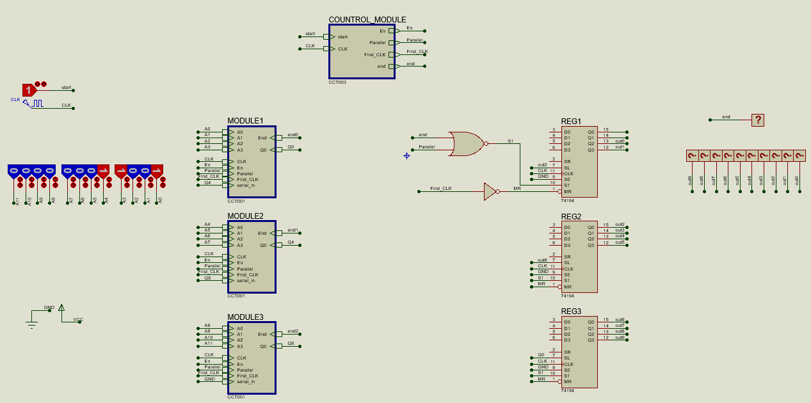

# Computer-Architecture-Lab

  
    

## Course Overview
The Computer Architecture Laboratory course provides hands-on experience with the principles and techniques used in the design and analysis of computer architectures. This course is essential for understanding how computers work at a fundamental level, and it involves practical lab sessions to reinforce theoretical concepts. You can download lab manual from [here](https://github.com/foratik/Computer-Architecture-Lab/blob/main/Arch%20Lab.pdf). 

Here is an image of the available chips in the laboratory:

  
    

## Instructors
- Professor Hossein Asadi
- Professor Hamid Sarbazi-Azad
- Ms. Atiyeh Gheibi

## Team Members:
- [Zahra Azar](https://github.com/Azar-Z)
- [Saeed Forati K.](https://github.com/foratik)
- [Amirhossein Souri](https://github.com/Amir14Souri)

## Projects:

### Experiment 1 :: 3-Digit BCD Adder
The user guide video is available for download [here](https://github.com/foratik/Computer-Architecture-Lab/blob/main/Az1/Assets/Experiment1-User-Guide-Video.mp4).

  
    
    

 

### Experiment 2 :: 6-Bit Carry Select Adder
The user guide video is available for download [here](https://github.com/foratik/Computer-Architecture-Lab/blob/main/Az2/Assets/Experiment2-User-Guide-Video.mp4).

  
    
    

### Experiment 3 :: 4-Bit Multiplier
The user guide video is available for download [here](https://github.com/foratik/Computer-Architecture-Lab/blob/main/Az3/Assets/Experiment3-User-Guide-Video.mp4).

  
    
    

### Experiment 4 :: 32-Bit Floating Point Adder and Subtractor

  
    

### Experiment 5 :: 3-digit BCD to 10-bit Binary Converter
The user guide video is available for download [here](https://github.com/foratik/Computer-Architecture-Lab/blob/main/Az5/Assets/Experiment5-User-Guide-Video.mp4).

  
    

### Experiment 6 :: ALU
The user guide video is available for download [here](https://github.com/foratik/Computer-Architecture-Lab/blob/main/Az6/Assets/Experiment6-User-Guide-Video.mp4).

  
    
    

### Experiment 7 :: Fibonacci Sequence Calculator 
The user guide video is available for download [here](https://github.com/foratik/Computer-Architecture-Lab/blob/main/Az7/Assets/Experiment7-User-Guide-Video.mp4).

  
    

